# chs-notification-sender-api

```mermaid
flowchart LR
    ExternalApp["External CHS App"] -->|REST| Module1
    Module1["📌 sender-api"] -->|Kafka| Module2
    Module2["kafka-consumer"] -->|REST| Module3
    Module3["govuk-notify-api"] -->|REST| GovUKNotify
    GovUKNotify["GovUK Notify"]
    
    subgraph PoseidonSystem["🔱 chs-notification"]
        Module1
        Module2
        Module3
    end
    
    %% Styling for all elements - light/dark mode compatible
    classDef normal fill:#f8f8f8,stroke:#666666,stroke-width:1px,color:#333333,rx:4,ry:4
    classDef current fill:#0099cc,stroke:#007799,stroke-width:2px,color:white,rx:4,ry:4
    classDef external fill:#e6e6e6,stroke:#999999,stroke-width:1px,color:#333333,rx:4,ry:4
    classDef system fill:transparent,stroke:#0077b6,stroke-width:1.5px,stroke-dasharray:3 3,color:#00a8e8,rx:10,ry:10
    
    class Module1 current;
    class Module2 normal;
    class Module3 normal;
    class ExternalApp external;
    class GovUKNotify external;
    class PoseidonSystem system;
    %% Adding clickable links to GitHub repos
    click Module2 "https://github.com/companieshouse/chs-notification-kafka-consumer" _blank
    click Module3 "https://github.com/companieshouse/chs-gov-uk-notify-integration-api" _blank
```



## Overview

This service:
- Receives requests to send emails or letters via a REST interface
- Publishes to the relevant Kafka topic
- Is Module 1 of 3 in the [chs-notification system](https://companieshouse.atlassian.net/wiki/spaces/IDV/pages/5146247171/EMail+Service)

## Related Services

- [chs-notification-kafka-consumer](https://github.com/companieshouse/chs-notification-kafka-consumer) (Module 2, consumes from Kafka topics published by Module 1 and sends requests to Module 3 via REST)
- [chs-gov-uk-notify-integration-api](https://github.com/companieshouse/chs-gov-uk-notify-integration-api) (Module 3, receives requests from Module 2 via REST and sends to GovUK Notify via REST)

## Endpoints

The service exposes the following endpoints:

- **Main API endpoints**: See [API Documentation](https://github.com/companieshouse/private.api.ch.gov.uk-specifications/blob/master/generated_sources/docs/chs-notification-sender-api/README.md)
- **Service health**: `GET /notification-sender/healthcheck`

## Prerequisites

- Java 21
- Maven

## Running Locally

### Prerequisites
Start a Kafka broker to allow messages to be sent:
```bash
docker compose up KafkaBroker
```

### Running the Application

#### Option 1: Using IntelliJ IDEA
1. Open the project in IntelliJ
2. Set Project SDK to Java 21
3. Locate the main application class: [ChsNotificationSenderApiApplication.java](src/main/java/uk/gov/companieshouse/chs/notification/sender/api/ChsNotificationSenderApiApplication.java)
4. Right-click and select "Run" or "Debug"

#### Option 2: Using Maven CLI
```bash
mvn spring-boot:run
```

## Repository Structure

```
chs-notification-sender-api/
│── src/                    
│   ├── main/               # Main application code
│   └── test/               # Test code
│── pom.xml                 # Dependencies
│── api-collections/
│   ├── bruno/              # Bruno API collection
│   └── postman/            # Postman API collections
│── ecs-image-build/        # ECS Dockerfile
│── terraform/              # Infrastructure code
│── ...                     # Other files/folders
└── README.md               # This file
```

## Terraform ECS

### What does this code do?

The code present in this repository is used to define and deploy a dockerised container in AWS ECS.
This is done by calling a [module](https://github.com/companieshouse/terraform-modules/tree/main/aws/ecs) from terraform-modules. Application specific attributes are injected and the service is then deployed using Terraform via the CICD platform 'Concourse'.


Application specific attributes | Value                                | Description
:---------|:-----------------------------------------------------------------------------|:-----------
**ECS Cluster**        |{{notifications}}                                      | ECS cluster (stack) the service belongs to
**Load balancer**      |{env}-{{chs-internalapi}}                                            | The load balancer that sits in front of the service
**Concourse pipeline**     |[Pipeline link]({{https://ci-platform.companieshouse.gov.uk/teams/team-development/pipelines/chs-notification-sender-api}}) <br> [Pipeline code]({{https://github.com/companieshouse/ci-pipelines/blob/master/pipelines/ssplatform/team-development/chs-notification-sender-api}})                                  | Concourse pipeline link in shared services


### Contributing
- Please refer to the [ECS Development and Infrastructure Documentation](https://companieshouse.atlassian.net/wiki/spaces/DEVOPS/pages/4390649858/Copy+of+ECS+Development+and+Infrastructure+Documentation+Updated) for detailed information on the infrastructure being deployed.

### Testing
- Ensure the terraform runner local plan executes without issues. For information on terraform runners please see the [Terraform Runner Quickstart guide](https://companieshouse.atlassian.net/wiki/spaces/DEVOPS/pages/1694236886/Terraform+Runner+Quickstart).
- If you encounter any issues or have questions, reach out to the team on the **#platform** slack channel.

### Vault Configuration Updates
- Any secrets required for this service will be stored in Vault. For any updates to the Vault configuration, please consult with the **#platform** team and submit a workflow request.

### Useful Links
- [ECS service config dev repository](https://github.com/companieshouse/ecs-service-configs-dev)
- [ECS service config production repository](https://github.com/companieshouse/ecs-service-configs-production)
